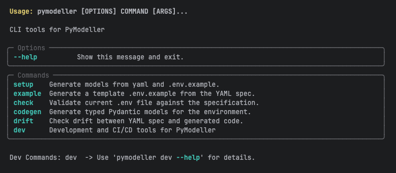

# PyModeller


[](LICENSE)
[](https://sonarcloud.io/summary/new_code?id=pymodeller_PyModeller)
[](https://github.com/pymodeller/PyModeller/actions)
[](https://github.com/pymodeller/PyModeller/actions)
[](https://github.com/astral-sh/ruff)
[](https://sonarcloud.io/summary/new_code?id=pymodeller_PyModeller)

**PyModeller** is a __DevOps-oriented__ CLI tool designed to synchronize infrastructure requirements with Python
application code. By utilizing a single YAML "Source of Truth," PyModeller automates the
generation of Pydantic models, Peewee ORM classes, and `.env` templates, ensuring your
configuration and database schemas never drift from your documentation.

## Core Features

* **Code Generation**: Instant creation of typed Pydantic models or Peewee schemas from YAML.
* **Traceable Settings**: Automatically generates a `BaseTraceableSettings` class. All settings inherit from this,
enabling data source tracking and native YAML loading capabilities.
* **Environment Templates**: Auto-generate `.env.example` files for seamless developer onboarding.
* **Validation & Safety**: Verify local `.env` files against specifications to catch errors before runtime.
* **Drift Detection**: Identify discrepancies between your YAML definitions and existing Python code.

## Project Initialization & Core Models

By default, PyModeller looks for a `py_modeller.yaml` file in the root of your project. This file must contain two main sections: `config` and `sections`.

### The 'General' Section
For Pydantic model generation, it is **required** to define a section named `General`. This section is used to generate the `general_setting` class, which serves as the primary configuration entry point.
* **Centralized Access**: This allows you to import the global configuration state from anywhere in your application.
* **Project Metadata**: It typically holds flags like `LOCAL_DEV`, `N_THREADS`, or global API keys.


 ---

## Installation

Install the package using [uv](https://github.com/astral-sh/uv) or pip:

```bash
 uv add pymodeller
```

---

## Usage

 The CLI provides four main commands to manage your development workflow:

### 1. Generate models
 Generate typed Pydantic models or Peewee code for your project.
```bash
pymodeller codegen
```

### 2. Example Environment Generation
 Generate a template .env.example file based on your YAML specification to help collaborators set up their environment.
```bash
pymodeller example
```

### 3. Environment Check
 Validate your current .env file against the YAML specification to ensure all required variables are present and correctly formatted.
```bash
pymodeller check
```

### 4. Drift Detection
 Check for "drift" between your YAML specification and the code already generated. This ensures that your Python models haven't fallen out of date.
```bash
pymodeller drift
```

 ---

## CLI Command Reference


 ---

## Data Loading & Specification

The project uses a structured YAML-to-Object mapping to manage environment variables and database schemas.
The py_modeller.yaml acts as the Single Source of Truth, which is parsed into an EnvSpec instance.


## Environment Data Model Specification (YAML)

This document defines the schema for the `py_modeller.yaml` file. This file is used by the `loader.py` to generate typed
Python dataclasses and manage environment variables, settings, and database schemas.

####  Validation
The loading process includes a mandatory validate_no_duplicates() call which ensures:
1. No two environment variables share the same env_name.
2. No two Python attributes (aliases) collide within the same section.


---

 ## Technical Specification

### BaseTraceableSettings
 Every generated settings class inherits from `BaseTraceableSettings`. This core class provides:
* **Source Tracking**: Maintains a record of where each setting value originated (Environment, YAML, or Default).
* **YAML Loader**: Built-in methods to populate settings directly from structured YAML files.

### 1. Global Config (`config`)
 Defines the output paths for generated files.

 | Key | Description |
 | :--- | :--- |
 | `PYDANTIC_OUT` | Main file path for Pydantic models. |
 | `PYDANTIC_FOLDER`| Directory for individual Pydantic model files. |
 | `PEEWEE_OUT` | Main file path for the Peewee ORM models. |
 | `PEEWEE_FOLDER` | Directory for individual ORM model files. |


### 2. Root Structure
The YAML must contain a top-level `sections` key which is a list of environment groups.

```yaml
sections:
- name: "ExampleSection"
  variables: []
```

---

### 3. Section Schema (`EnvSection`)

| Key | Type | Description |
| :--- | :--- | :--- |
| `name` | `string` | **Required**. The display name of the section. |
| `description` | `string` | Brief explanation of the section's purpose. |
| `env_prefix` | `string` | Prefix added to all variables in this section (e.g., `APP_`). |
| `type` | `string` | Section category: `settings`, `model`, or `peewee` (Default: `model`). |
| `include_general` | `boolean` | Whether to include general configurations (Default: `true`). |
| `include_literal` | `boolean` | Used for FastAPI/literal exports (Default: `true`). |
| `database` | `object` | *Optional*. Metadata for Database tables (See [DBSpec](#4-database-specification-dbspec)). |
| `variables` | `list` | A list of variable definitions (See [EnvVarSpec](#3-variable-specification-envvarspec)). |

---

### 4. Variable Specification (`EnvVarSpec`)

| Key | Type | Description |
| :--- | :--- | :--- |
| `name` | `string` | **Required**. The variable name (automatically converted to `snake_case` in Python). |
| `type` | `string` | Data type mapping (See [Supported Types](#supported-types)). |
| `description` | `string` | Documentation for the variable. |
| `default` | `any` | Default value if the environment variable is not set. |
| `required` | `boolean` | If true, the loader validates its existence. |
| `secret` | `boolean` | If true, masks the value in logs (Type `secret` is a shortcut). |
| `alias` | `string` | Custom Python attribute name (Defaults to `camelCase` of name). |
| `db_spec` | `object` | *Optional*. ORM field configuration (See [DBField](#5-database-field-specification-dbfield)). |

#### Supported Types
The loader normalizes the following types:
- **Primitives:** `string`, `integer`, `number` (float), `boolean`, `datetime`.
- **Special:** `secret` (shortcut for `str` + `secret: true`), `path`, `list`.
- **Numpy Arrays:** `pnd.NpNDArrayUint8`, `pnd.NpNDArrayInt8`, `pnd.NpNDArrayFp32`.

> Note: We are actively working on expanding this list to support additional data types and specialized structures in
> future releases.

---

### 5. Database Specification (`DBSpec`)
Defined at the section level for Peewee/ORM metadata.

| Key | Type | Description |
| :--- | :--- | :--- |
| `table_name` | `string` | Explicit name for the database table. |
| `schema` | `string` | Database schema (e.g., `public`). |
| `primary_key` | `list` | List of field names that form a composite primary key. |
| `indexes` | `list` | Custom database index definitions. |
| `constraints` | `list` | Table-level constraints. |

---

### 6. Database Field Specification (`DBField`)
Defined under the `db_spec` key within a variable.

| Key | Type | Description |
| :--- | :--- | :--- |
| `primary_key` | `boolean` | Marks the field as the primary key. |
| `allow_null` | `boolean` | Allows NULL values in DB (Default: `false`). |
| `unique` | `boolean` | Adds a UNIQUE constraint. |
| `max_length` | `integer` | Max characters for string fields. |
| `foreign_key` | `string` | Reference to another model/table. |
| `choices` | `list` | Enforces a list of allowed string values. |
| `max_digits` | `integer` | Precision for decimal numbers. |
| `decimal_places`| `integer` | Scale for decimal numbers. |

---

### Example Usage

```yaml
sections:
- name: "Network"
  env_prefix: "NET"
  type: "settings"
  variables:
    - name: "host_address"
      type: "string"
      default: "0.0.0.0"
      alias: "serverHost"

- name: "UsersTable"
  type: "peewee"
  database:
    table_name: "app_users"
  variables:
    - name: "id"
      type: "integer"
      db_spec:
        primary_key: true
    - name: "api_key"
      type: "secret"
      required: true
```

 ---

## Contributing

 Contributions are welcome! We value your help in making PyModeller better.

 Before you get started, please refer to our [Contributing Guide](CONTRIBUTING.md) for details on our development
 workflow, coding standards, and how to submit pull requests.

 If you encounter a bug or have a feature request, feel free to [open an issue](https://github.com/pymodeller/PyModeller/issues).

## License

 This project is licensed under the MIT License.
